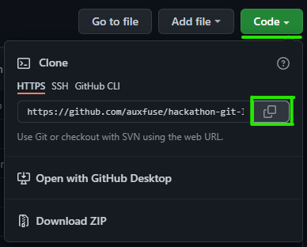
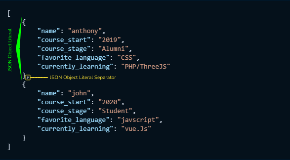

# Basics guide to making your first Pull Request (PR)

By following the below guide, your actions will have created a card on the Landing page of the project, with some information displayed about you. It's a fun little exercise that gives you the steps to navigate the project and make your first Open Source Contribution to this project (or maybe it is your very first ever!) via Pull Request (PR). 🤜

Get started! Make your first PR and get going into the world of open source! 

## 👇 Participant steps: 👇

### **Project Setup**
- Fork the repo. Super simple here, go to [the repo](https://github.com/auxfuse/hackathon-git-labs), and click on the "Fork" button in the top right of the screen. The window should then refresh, and you should be redirected to your newly created Fork of the project.

    🍴 <-- So what is a fork? It's a copy of the original repository. But one that you own. Any changes you make to the project in the fork won't affect the original. To affect the original, continue following the steps below to make a Pull Request! 😉 [Learn more about Forks](https://docs.github.com/en/pull-requests/collaborating-with-pull-requests/working-with-forks/about-forks)

- Go to your preferred IDE/Editor and clone the Forked repo.
    - Go to the forked repository in Github. This can be found in your account, under "repositories".
    - Hit the green "Code" button, and then click on "HTTPS" and copy the link.
    
    - In your IDE/Editor, open a terminal/command line, and enter the following: `git clone {insert copied url here}` and hit "Enter" on your keyboard.
    - The Forked repository will now clone to your preferred development method.
        - If you are using Gitpod, you do not need to do these steps. Instead, you can go to the forked repository and click on the green "Gitpod" Extension button to open the project for editing.

- Your project should already be opened in your preferred IDE/Editor at this point, but just in case. Open your IDE/Editor, and then open the project. 😀
- Before doing any code, lets open a terminal/command line.
- Set the upstream by running this command `git remote add upstrem https://github.com/auxfuse/hackathon-git-labs.git`, in your opened terminal/command line.
    - We can then check to ensure that the remote has been added correctly by running `git remote -v` in the terminal. And you should get this type of response.
    ```
    $ git remote -v
    origin    https://github.com/YOUR_USERNAME/hackathon-git-labs.git (fetch)
    origin    https://github.com/YOUR_USERNAME/hackathon-git-labs.git (push)
    upstream  https://github.com/auxfuse/hackathon-git-labs.git (fetch)
    upstream  https://github.com/auxfuse/hackathon-git-labs.git (push)
    ```

    The _"origin"_ in the above snapshot is your Forked repository. The _"upstream"_ is the link we just set so that our newly Forked repository can _**see**_ the original repository and vice-versa. Lots of thought here, and it does take a bit of getting used to! So stick with it. 🤔💭 Basically all we are doing here, is setting up the relationship between the original repository and the fork. 🤝 Without this step, we can't make a Pull Request.

    **N.B**: If you are using Gitpod, and you open the forked repository using Gitpod this step will be done for you by default. But make sure to double check using the `git remote -v` command. 😀

- Our last step before we jump into the project is to Create a branch.
    - A branch is another layer of security for us to lean on. It's a diverging path from the main branch that exists by default in every repository. [Learn more about Branches](https://docs.github.com/en/pull-requests/collaborating-with-pull-requests/proposing-changes-to-your-work-with-pull-requests/about-branches)
    - Inside your terminal/command line in your IDE/Editor, run this command: `git checkout -b branch-name`, replacing the "branch-name" with something more unique to you.
    - This command creates a branch, and automatically moves you into that branch 😁.
    - Lastly, we need to tell Git that this new branch is to be the current **tracked** branch. Back into our terminal, we now run: `git push -u origin branch-name`. 🌿🌳

**_All of the initial git setup is done. All in all, if you follow this to the letter, this is a few minutes of work._ 😅 _Crazy to think of something you do regularly just by muscle memory alone, when viewed in the written word, is quite a lengthy process._ 🤯🧠**

### **Adding to the Project**

- Go to the `community.json` file and copy the following JSON object and replace the _**values**_ with your own:
```json
{
    "name": "your_name_or_alias",
    "course_start": "year_of_course_start",
    "course_stage": "student_alum_staff_mentor",
    "favorite_language": "favorite_language",
    "currently_learning": "latest_learning"
}
```

For reference, the _**values**_ are on the right side of the colon (`:`), and are contained inside the double quotes (`""`). Take a look at this snapshot:


Keep these short and sweet. This is just a small blurb about you as a developer. _Anything that exceeds the bounds of the card itself will be truncated._

- Paste this updated JSON Object after the latest object in the `community.json` file. Keeping to the current format. Separate your pasted JSON Object from the last using a comma, (`,`).
- A small example of the json file, to take note of the structure, including the separation of each JSON Object using a comma, (`,`):



- The JSON is formatted as follows:
    - Notice that the JSON objects, those inside the curly braces, and inclusive of the curly braces `{}`, are separated by a comma. 👈 **This part is super important when pasting in your own JSON Object.**
    - Each individual set of key/value pair inside the JSON objects, are also separated by a comma.
    - Keys and values are separated by a colon, `:`. With keys on the left of the colon, and values on the right. And both are surrounded by double quotes, (`""`).
    - Take note of the following example of a Key/Value pair:
    
    

- After you have added yourself to the `community.json` file, you can now view the project in preview mode to see your card added to the website.
    - Depending on your IDE/Editor of choice, there are a few ways to do this. Most IDEs/Editors will have a built in preview option. If you are unsure, a quick google search on how to do this for your editor is the best course of action.

### **The Pull Request**

- Add all your work to the branch using `git add .`, using the terminal/command line in your IDE/Editor. 
- Commit it using `git commit -m "meaningful commit message here"`.
- push to the branch
- at this stage, you might be reminded to set the branch as the current trackable option.
- create PR


